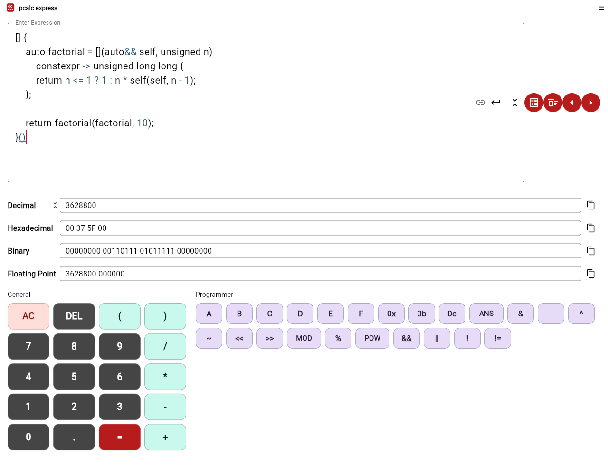
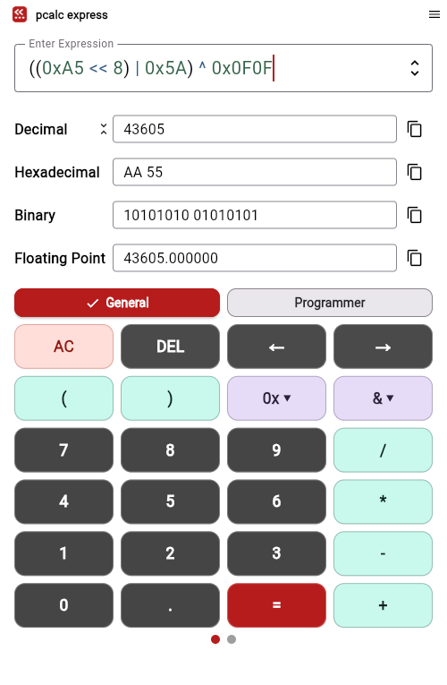

# PCalc Express

A programmer's calculator for C/C++ expressions. Cast values, shift bits, work
with hex and binary, and see the result in four number formats at once.

**[Open the calculator](https://richyo-codes.github.io/pcalc-express/)** — runs in
your browser with WebAssembly.

The [recursive factorial example](test/fixtures/recursive_factorial.cpp)
evaluates `10!` entirely at compile time.

The compact editor is equally useful for masks, shifts, and protocol bytes:
`((0xA5 << 8) | 0x5A) ^ 0x0F0F` produces the recognizable `0xAA55`.

## Built for expressions

Powered by [Clang constexpr](https://github.com/richyo-codes/dart-clang-constexpr),
PCalc Express uses C/C++ constant-expression rules, including casts, bitwise
operations, character literals, and constexpr-capable C++ lambdas. Choose your language
standard in **Settings → Advanced**.

| Try this | Result |
| --- | --- |
| `(0xFF << 8) \| 0xA5` | `65445` (`0xFFA5`) |
| `(unsigned char)255` | `255`, with an 8-bit result type |
| `static_cast<int>(3.75)` | `3` in C++ mode |
| `0b1010 ^ 0b0011` | `9` |
| `'A' + 1` | `66` |
| `7 / 2` / `7.0 / 2` | `3` / `3.5` |

Decimal, hexadecimal, binary, and floating-point results each have a copy button.
Integer width and signedness follow the result type supplied by the evaluator.
`^` means XOR; shifts require integers. Standard-library headers and functions
are not generally available.
Invoked lambdas can contain local variables, loops, and recursion when permitted
by the selected C++ standard. Top-level declarations and preprocessor directives
are not accepted; results must be numeric constant expressions.

## Made for editing

- **Enter** or **=** calculates; **Ctrl+E** focuses the expression.
- Expand the expression editor for multiple lines. **Enter** inserts a newline
  while expanded; **Ctrl+Enter** (or **⌘+Enter**) calculates. A newline button
  is available when using the calculator keypad. Drag the grip below the expanded
  editor to resize it. Collapse keeps your text and chosen height.
- The keypad inserts at the cursor. **←/→**, **DEL**, and **AC** handle editing.
- On narrow screens, **0x ▾** opens hex digits and prefixes; **& ▾** opens bitwise
  and logical operators. The expression gets the full row.
- Syntax coloring and bracket matching help you read nested expressions.
- Reuse calculations from session history, expand or collapse result units, and
  switch between light and dark themes from the application menu.
- **Settings → Use system keyboard** lets you choose the phone keyboard or the
  calculator keypad. Your choice is saved; physical keyboards remain usable.
- Screen readers receive named expression, result, keypad, application, and
  window controls. See the [accessibility guide](docs/accessibility.md) for
  widget tests and real GTK4/AT-SPI validation.

Clang is the preferred evaluator where available. Optional backends have their
own syntax and platform requirements.

## Development

See the [development guide](docs/DEVELOPMENT.md) for local builds, tests,
screenshots, and GitHub Pages deployment, or [Flatpak packaging](docs/FLATPAK.md)
for Linux installation and packaging details.

## Credits and license

Inspired by [AnalogX PCalc](https://www.analogx.com/contents/download/programming/pcalc/freeware.htm).
Built with Flutter and [LLVM/Clang](https://llvm.org/), with
[TinyExpr++](https://github.com/Blake-Madden/tinyexpr-plusplus) retained as an
alternative evaluator.

Licensed under [GNU AGPLv3](LICENSE), version 3 only. Dependencies retain their
respective licenses.
